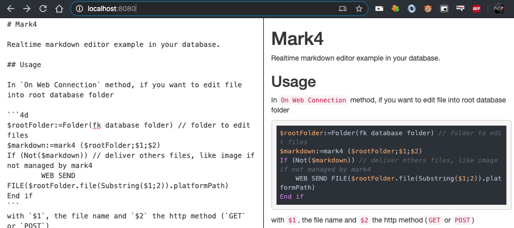

# Mark4Down
[![language][code-shield]][code-url] [![language-top][code-top]][code-url] ![code-size][code-size] [![release][release-shield]][release-url] [![license][license-shield]][license-url]
[![discord][discord-shield]][discord-url] 

Realtime markdown editor for your 4D database.

* Edit documentation from your local machine or remote device such as iPad.
* The file is saved automatically. New file too.
* See list of available, missing or orphan documentation files (toolbar buttons at the right)
* Open github or see diff from last commit



> Quick install: Do the command described by [install](#install), then [accept host database event](#by-accepting-to-execute-on-host-database-event-method-of-the-component) in your database, re-start your database and finally open  http://localhost:8349

## Launch web server

This a web component. Your need to start a web server to deliver the component interface in your web browser.

### Using the component web server

If do not want to pollute your database web server, a 4D component could provide one, since new 18R release.

There is two way to launch the component web server:

#### by accepting to execute `On Host Database Event` method of the component

_In database setting, security tab, "Execute  `On Host Database Event` ..._

💡 This is the easiest way to have an editor always ready for all your database by placing this component into your 4D app Components folder. See [install](#install) section.

A web server for the component will be started when your database start and the default url will be 
[http://localhost:8349](http://localhost:8349) _(as defined by component [settings.4DSettings](Project/Sources/settings.4DSettings))_

#### or by starting the component web server yourself

```4d
mark4downWebServer().start() //  you can choose options like HTTP port
```

### Using your database web server

In `On Web Connection` method, if you want to edit file into your root database folder do

```4d
$markdown:=mark4down (Folder(fk database folder) ;$1;$2)
If (Not($markdown))
  // do other requests on your server
End if
```

> with `$1` and `$2` parameters of  `On Web Connection` database method.

You must copy WebFolder of component into your database or make a redirection and use `WEB SEND FILE`.

Then open your browser to see the web markdown editor

## Install

### In your 4D for all your databases

Just launch this command in terminal for macOS to install the lastest released version

```bash
curl -sL https://mesopelagique.github.io/Mark4Down/install.sh | sh
```

Or manually download and drag the component in your 4D `Components/` folder (on macOS for instance `/Applications/4D.app/Contents/Components/`)

⚠️ The component folder must be renamed to `Mark4Down.4dbase` if you use sources from github.

### For one database

Drag the component in the `Components` folder into your database.

## More

### Add your own style

Go to `WebFolder` and add it to `style.css` file or add a link to a css file into `Resources/editor.html`

### Access documentation files list without editor

#### Available

Go to `/mark4down/list`, ex:  http://localhost:8349/mark4down/list

#### Missing

Go to `/mark4down/missing`, ex:  http://localhost:8349/mark4down/missing

#### Full git diff

Go to `/mark4down/diff`, ex:  http://localhost:8349/mark4down/diff/

## Acknowledgment

- Markdown editor by [SimpleMDE](https://github.com/sparksuite/simplemde-markdown-editor)
- Code syntax highlighting by [highlightjs](https://highlightjs.org/) with [4d addons](https://github.com/highlightjs/highlightjs-4d)

---

[](https://mesopelagique.github.io/)

<!-- MARKDOWN LINKS & IMAGES -->
<!-- https://www.markdownguide.org/basic-syntax/#reference-style-links -->
[code-shield]: https://img.shields.io/static/v1?label=language&message=4d&color=blue
[code-top]: https://img.shields.io/github/languages/top/mesopelagique/Mark4Down.svg
[code-size]: https://img.shields.io/github/languages/code-size/mesopelagique/Mark4Down.svg
[code-url]: https://developer.4d.com/
[release-shield]: https://img.shields.io/github/v/release/mesopelagique/Mark4Down
[release-url]: https://github.com/mesopelagique/Mark4Down/releases/latest
[license-shield]: https://img.shields.io/github/license/mesopelagique/Mark4Down
[license-url]: LICENSE.md
[discord-shield]: https://img.shields.io/badge/chat-discord-7289DA?logo=discord&style=flat
[discord-url]: https://discord.gg/dVTqZHr
